# AI Review

Kotlin/Ktor-сервис для автоматического ревью GitHub Pull Request с помощью DeepSeek и локального RAG по `docs/**/*.md` из ревьюируемого commit.

При событиях `opened`, `reopened`, `synchronize` и `ready_for_review` сервис:

1. проверяет HMAC-подпись GitHub webhook;
2. получает изменённые файлы и Markdown-документацию через GitHub API;
3. разбивает документацию на чанки и считает embeddings локальным Ollama;
4. сохраняет индекс на локальном volume и переиспользует его, пока blob SHA документации не изменились;
5. для каждого текстового diff извлекает релевантные фрагменты документации и отправляет их вместе с patch в DeepSeek;
6. одним GitHub review публикует inline-комментарии на допустимых RIGHT-строках diff;
7. если замечаний нет и проверка была полной, публикует в PR сообщение `Everything OK`; при пропущенных файлах, отсутствующей документации или отклонённых модельных комментариях сообщает, что результат неполный.

Draft PR игнорируются. Повторное событие для того же `repository + PR + head SHA` не создаёт дубликаты после успешного review.

## Архитектура

```mermaid
flowchart LR
    GH["GitHub pull_request webhook"] --> API["Ktor service"]
    API -->|"files, tree, blobs"| GHAPI["GitHub REST API"]
    API --> CHUNK["Markdown chunker"]
    CHUNK -->|"embeddings"| OLLAMA["Local Ollama"]
    OLLAMA --> IDX["Local JSON vector index"]
    IDX --> RETRIEVE["Cosine top-k retrieval"]
    RETRIEVE --> DS["DeepSeek Chat API"]
    DS --> VALIDATE["Line and JSON validation"]
    VALIDATE -->|"review or Everything OK"| GHAPI
```



Индекс содержит текст документации и векторы и остаётся на сервере. В DeepSeek уходят только patch конкретного файла и top-k релевантных чанков, а не весь репозиторий.

## Быстрый запуск

Требования: Docker Engine с Compose, доступ сервера к GitHub и DeepSeek.

Для полной интерактивной настройки на Debian/Ubuntu выполните:

```bash
chmod +x scripts/setup-and-run.sh
./scripts/setup-and-run.sh --install-docker
```

Скрипт при необходимости установит Docker из официального APT-репозитория, запросит GitHub App или token и DeepSeek API key, безопасно создаст `.env`, сгенерирует webhook secret, скачает `embeddinggemma:300m`, соберёт контейнер и дождётся ответа `/health`. Если Docker уже установлен, флаг `--install-docker` можно не указывать. Для повторного запуска с готовым `.env`:

```bash
./scripts/setup-and-run.sh --non-interactive
```

```bash
cp .env.example .env
# заполнить секреты в .env
docker compose up --build -d
```

Первый запуск скачает embedding-модель `embeddinggemma:300m`. Проверка состояния:

```bash
curl http://localhost:8080/health
docker compose logs -f ai-review
```

Webhook URL: `https://<ваш-домен>/webhooks/github`. Порт приложения — `8080`; TLS рекомендуется завершать на reverse proxy или ingress.

## Настройка GitHub App

Рекомендуемый production-вариант — GitHub App:

- Repository permissions: **Contents: Read**, **Pull requests: Read and write**, **Issues: Read and write**;
- Subscribe to events: **Pull request**;
- Webhook secret должен совпадать с `GITHUB_WEBHOOK_SECRET`;
- `GITHUB_APP_ID` — ID приложения;
- приватный PEM-ключ передаётся в `GITHUB_APP_PRIVATE_KEY`, переводы строк в `.env` записываются как `\n`.

GitHub App нужно установить в репозитории. Сервис сам создаёт короткоживущий installation token. Для простого стенда вместо пары App ID/ключ можно задать `GITHUB_TOKEN` с теми же правами; если заданы оба способа, используется token.

## Конфигурация

| Переменная | Обязательна | Значение по умолчанию |
|---|---:|---|
| `GITHUB_WEBHOOK_SECRET` | да | — |
| `GITHUB_APP_ID` + `GITHUB_APP_PRIVATE_KEY` | один способ GitHub auth | — |
| `GITHUB_TOKEN` | один способ GitHub auth | — |
| `GITHUB_API_URL` | нет | `https://api.github.com` |
| `DEEPSEEK_API_KEY` | да | — |
| `DEEPSEEK_BASE_URL` | нет | `https://api.deepseek.com` |
| `DEEPSEEK_MODEL` | нет | `deepseek-v4-flash` |
| `OLLAMA_BASE_URL` | нет | `http://ollama:11434` |
| `OLLAMA_EMBED_MODEL` | нет | `embeddinggemma:300m` |
| `RAG_INDEX_DIR` | нет | `data/indexes` |
| `RAG_CHUNK_SIZE` | нет | `1800` символов |
| `RAG_CHUNK_OVERLAP` | нет | `200` символов |
| `RAG_TOP_K` | нет | `5` |
| `MAX_PATCH_CHARS` | нет | `60000` |
| `PORT` | нет | `8080` |

При смене embedding-модели индекс автоматически пересчитывается. Секреты нельзя коммитить; `.env` исключён через `.gitignore` и `.dockerignore`.

## Локальная разработка

Нужна JDK 21. Ollama можно запустить отдельно, после чего:

```bash
./gradlew test
./gradlew run
```

На Windows используйте `gradlew.bat`. Для webhook-тестирования нужен публичный HTTPS endpoint или tunnel; GitHub передаёт событие `pull_request` методом POST.

## Ограничения GitHub diff

RAG сочетает семантический поиск EmbeddingGemma с точным лексическим совпадением кода и операторов. Документы правил с именами вроде `code-style`, `guidelines`, `standards`, `rules` и `security` обязательно добавляются в контекст (до 8 чанков), поэтому явное правило не теряется из-за ограничения `RAG_TOP_K`. В логах для каждого файла видны пути выбранных чанков, semantic/lexical score и число принятых или отклонённых комментариев модели.

GitHub не возвращает `patch` для бинарных файлов и иногда не включает его для слишком больших diff — такие файлы пропускаются, потому что корректный inline-комментарий без позиции в diff создать нельзя. DeepSeek-комментарии дополнительно фильтруются: номер строки обязан существовать в текущем RIGHT-side patch. За один review публикуется не более 50 комментариев и не более 10 на файл, что ограничивает шум и размер запроса. При таком пропуске сервис больше не публикует вводящее в заблуждение `Everything OK`.

## Проверка проекта

```bash
./gradlew clean test
docker compose config
```

Тестами покрыты проверка webhook-подписи, нумерация строк unified diff и Markdown chunking.
